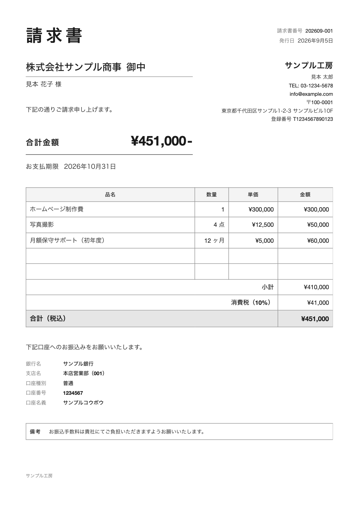
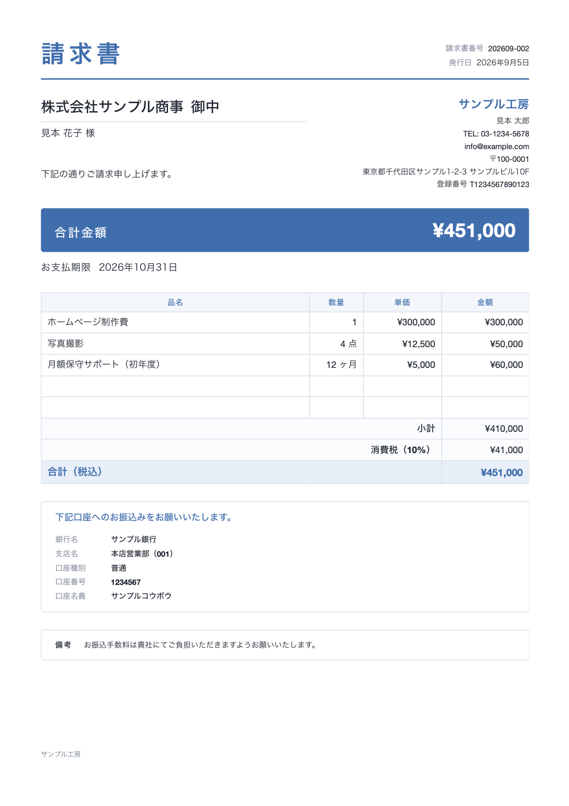

# 請求書くん（seikyusho-kun）

**宛先・名目・金額・締日**、この4つを言うだけで請求書PDFが出ます。
日本の適格請求書（インボイス制度）・軽減税率・源泉徴収に対応。

<p align="center">
  
  
</p>

```
$ seikyusho-kun new

  請求書くん

  ? 宛先は？         株式会社ABC
  ? 名目は？         ホームページ制作費
  ? 金額は？（税抜）  150000
  ? 締日は？         今月末（2026年9月30日）

  ✔ 発行しました: ~/Documents/請求書/2026/請求書_株式会社ABC_202609-001.pdf
```

---

## Claude Code から使う（おすすめ）

セットアップ時に「Claude Code から頼めるようにしますか？」で **はい** を選ぶと、
あとはこう言うだけで請求書が出ます。

> **「ABC社に、ホームページ制作費15万で請求書出して。締めは月末で」**

> **「先月と同じ内容で、B社の今月分を作って」**

> **「さっき作った請求書、メールで送る文面を見せて」**

Claude が金額・締日・敬称の付け方を判断してコマンドに変換します。
**メールは必ず文面を見せてから送るように作ってあります**（勝手に送信されません）。

Claude Code を使っていない方も、下のコマンドだけで全部できます。

---

## インストール

```bash
# 1. 入れる
npm install -g github:Icchaso/seikyusho-kun

# 2. 自分の情報を登録する（最初に1回だけ）
seikyusho-kun init

# 3. 発行する
seikyusho-kun new
```

`seikyu` でも呼べます。

> **npm での公開はこれからです。** 公開後は `npx seikyusho-kun` だけで使えるようになります。
> それまでは上のとおり GitHub から直接入れてください（やることは同じです）。

### 必要なもの

| | |
|---|---|
| Node.js | 18.17 以上 |
| ブラウザ | Google Chrome / Microsoft Edge / Chromium / Brave のどれか |

PDFはお使いのブラウザのエンジンで作ります。**追加のインストールは要りません**
（重い Chromium を別途ダウンロードすることもありません）。
うまく見つからないときは `SEIKYUSHO_CHROME` で場所を指定できます。

---

## できること

### 4つ言えば出る

```bash
seikyusho-kun new --to "株式会社ABC" --item "ホームページ制作費" --amount 150000 --due 月末
```

金額は `150000` `150,000` `¥150,000` `15万` のどれでも通ります。
締日は `月末` `翌月末` `30日後` `2026-09-30` `9月30日` `来月10日` のどれでも通ります。

明細が複数あるときは `--item` を並べます。数量・単位はその直前の `--item` に付きます。

```bash
seikyusho-kun new --to "株式会社ABC" \
  --item "ホームページ制作費" --amount 300000 \
  --item "写真撮影"         --amount 50000 --qty 4  --unit 点 \
  --item "月額保守"         --amount 60000 --qty 12 --unit ヶ月 \
  --due 翌月末
```

### 日本の請求書として、ちゃんとしている

- **適格請求書（インボイス制度）の記載要件**を満たします
  — 登録番号 / 税率ごとに区分した合計額 / 税率ごとの消費税額
- **軽減税率（8%）との混在**に対応。`--rate 8` を付けた品目に `※` が付き、
  税率ごとの区分行が自動で増えます
- **源泉徴収**（10.21%、100万円超の部分は20.42%）を計算して
  「お振込金額」を出せます。フリーランスの方はこれが要ります
- 消費税の端数処理は **税率ごとに1回だけ**。行ごとに丸めて合計がズレることがありません
- 外税 / 内税、切り捨て / 四捨五入 / 切り上げ を設定で選べます

### レイアウトが崩れない

- **A4 1枚に自動で収めます。** 作ったPDFのページ数を実際に数えて、はみ出していたら
  文字組みを1段詰めて作り直す、を繰り返します
- どうしても収まらない件数のときは複数ページにして、**各ページに明細の見出し行を
  繰り返し**、ページ番号（1 / 2）を入れます
- ヘッダーは常に上端、振込先・備考・フッターは常に最後
- 長い社名・長い品名・9桁の金額でも横にはみ出しません
  （これらは実際にブラウザで測って自動テストしています）

### 見た目は3つから選べて、自分のものにもできる

| テーマ | どんな見た目 |
|---|---|
| `plain`（既定） | 白地・黒文字・罫線のみ。どの業種・どの取引先に出しても浮かない |
| `modern` | ロゴとメインカラー1色でブランドを出す |
| `compact` | 明細が多い人向け。余白を詰めて行数を稼ぐ |

```bash
seikyusho-kun theme preview     # 3つ並べて見比べる
seikyusho-kun theme use modern  # 切り替える
```

すでに自社のフォーマットがある方は、書き出して直接編集できます。

```bash
seikyusho-kun theme eject plain --as mine   # HTML と CSS を書き出す
# ~/.seikyusho-kun/templates/mine/theme.css を編集
seikyusho-kun theme use mine
```

Claude Code をお使いなら、**手元の請求書PDFや画像を見せて「これに寄せて」と
頼むだけ**で、この CSS を書き換えてもらえます。

### メールで送る（使いたい人だけ）

```bash
seikyusho-kun send --setup            # Resend または SMTP を設定
seikyusho-kun send "株式会社ABC"       # ← 文面を表示するだけ。送らない
seikyusho-kun send "株式会社ABC" --yes # ← 確認したうえで送る
```

- **既定は必ず下書き確認**です。`--yes` を付けるまで送信しません
- **Resend**（無料枠 3,000通/月・100通/日）と **SMTP**（Gmailのアプリパスワード等）
  のどちらでも動きます
- APIキーは `~/.seikyusho-kun/.env`（本人だけが読める権限）にだけ保存されます
- 文面は `seikyusho-kun send --eject-template` で書き換えられます

### 毎月の自動発行（使いたい人だけ）

```bash
seikyusho-kun schedule add "株式会社ABC"   # 毎月末日に保守費5,000円、など
seikyusho-kun schedule install             # 毎日9:00に自動チェックを登録
seikyusho-kun run-due --dry-run            # 今日出る分の下見
```

macOS は launchd、Linux は cron、Windows はタスクスケジューラに登録します。

**メールの自動送信は、取引先ごとに明示して設定したときだけ**動きます。
既定はPDFを作るところまでで止まります。

---

## コマンド一覧

| コマンド | 何をするか |
|---|---|
| `init` | 発行者・振込先・デザインの初期設定 |
| `new` | 請求書を発行する |
| `list` | 発行した請求書の一覧 |
| `clients` | 取引先の登録・確認・削除 |
| `theme` | デザインの切り替え、自作テンプレートの書き出し |
| `send` | メールで送る（既定は文面確認のみ） |
| `schedule` | 毎月の自動発行の設定 |
| `run-due` | 今日が発行日の分をまとめて発行 |
| `doctor` | 実際にPDFを1枚出して、動く状態か確かめる |

`seikyusho-kun --help` で全オプションが出ます。

---

## データはどこにあるか

すべて **自分のパソコンの中だけ** です。外部のサーバーに送信されることはありません
（メール送信を自分で設定したときだけ、そのメールが送られます）。

```
~/.seikyusho-kun/
├── config.json      自分の情報・振込先・デザイン設定
├── clients/         取引先
├── issued.json      発行台帳
├── templates/       自作テンプレート
├── logs/            自動発行のログ
└── .env             メールの認証情報（本人だけが読める権限）
```

PDFの保存先は既定で `~/Documents/請求書/{年}/` です。`config.json` で変更できます。

---

## 会計ソフトなどに繋ぐ

`config.json` に1行足すと、発行のたびに好きなコマンドを実行できます。

```json
"hooks": { "afterIssue": "~/bin/my-sync.sh" }
```

`INVOICE_PDF` `INVOICE_NO` `CLIENT_NAME` `INVOICE_TOTAL` などが環境変数で渡ります。
CSV台帳への追記、会計ソフトのAPI、Slack通知などをここに繋いでください。
実例は [`examples/afterIssue-hook.example.sh`](examples/afterIssue-hook.example.sh) にあります。

---

## ドキュメント

- [セットアップ](docs/セットアップ.md)
- [テンプレートのカスタマイズ](docs/テンプレートのカスタマイズ.md)
- [メール送信](docs/メール送信.md)
- [定期発行](docs/定期発行.md)
- [よくある質問](docs/FAQ.md)

## 免責

このツールは請求書の**作成**を助けるものです。記載内容の正しさ、税務上の取り扱い、
インボイス制度への適合の最終的な判断は利用者ご自身の責任でお願いします。
迷う点は税理士にご確認ください。

## ライセンス

[MIT](LICENSE)

---

<p align="center">
  <sub>Made in Japan 🇯🇵 &nbsp;|&nbsp; English README: <a href="README.en.md">README.en.md</a></sub>
</p>
